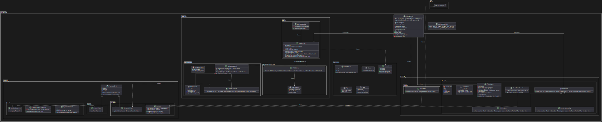

# 🤖 Mecalux AMR - Sistema de Gestió de Flota de Robots Autònoms

<p align="center">
  
</p>

## 📋 Resum del Projecte

El **Mecalux AMR** és un sistema centralitzat de gestió de flotes de robots mòbils autònoms (AMR) dissenyat per a magatzems logístics. El sistema coordina una flota de robots per executar tasques de recollida (*pickup*) i lliurament (*dropoff*) de manera eficient, evitant col·lisions en temps real.

### Característiques Principals

- 🤖 **Gestió Multi-Robot** - Coordinació de 1 a 100+ robots simultàniament
- 📦 **Assignació Dinàmica de Tasques** - Optimització contínua mitjançant algoritmes VRP
- 🗺️ **Mapes de Doble Capa** - NavMesh per planificació i Bitmap per navegació
- 🚧 **Evitació de Col·lisions en Temps Real** - Basat en l'algoritme ORCA
- ⚡ **Planificació Reactiva** - Tres escenaris d'scheduling segons el patró d'arribada de tasques
- 🔄 **Injecció de Tasques en Calent** - Afegir noves tasques sense aturar el sistema
- 📊 **Dashboard Frontend en Temps Real** - Visualització interactiva de l'estat de la flota

---

## 🏗️ Arquitectura

El sistema segueix una **arquitectura de tres capes**:

```
┌─────────────────────────────────────────────────────────────────────────────┐
│                           FLEET MANAGER                                      │
│                     (Orquestrador del Sistema)                               │
├─────────────────────────────────────────────────────────────────────────────┤
│                                                                              │
│   ┌─────────────────┐  ┌─────────────────┐  ┌─────────────────┐             │
│   │   CAPA 1        │  │   CAPA 2        │  │   CAPA 3        │             │
│   │   Mapping       │  │   Planning      │  │   Physics       │             │
│   │                 │  │                 │  │                 │             │
│   │ • StaticBitMap  │  │ • VRP Solver    │  │ • RobotDriver   │             │
│   │ • InflatedBitMap│  │ • RobotAgent    │  │ • Theta* Paths  │             │
│   │ • DynamicBitMap │  │ • CostMatrix    │  │ • ORCA          │             │
│   │ • NavMesh       │  │ • TaskLoader    │  │ • FastLoop      │             │
│   │ • POIRegistry   │  │                 │  │                 │             │
│   └─────────────────┘  └─────────────────┘  └─────────────────┘             │
│                                                                              │
└─────────────────────────────────────────────────────────────────────────────┘
```

| Capa | Nom | Funció | Freqüència |
|------|-----|--------|------------|
| **Capa 1** | Mapping | Infraestructura estàtica (NavMesh, POIs) | Offline |
| **Capa 2** | Planning | Assignació de tasques (VRP solver) | 1 Hz |
| **Capa 3** | Physics | Execució de camins (Theta*, ORCA) | 20 Hz |

---

## 📁 Estructura del Projecte

```
Mecalux-AMR/
├── api/                        # Servidor API i fitxers de sortida JSON
│   ├── server.js               # Servidor Express per al frontend
│   └── output/                 # Fitxers JSON de telemetria en temps real
│       ├── robots.json         # Posicions dels robots (20 Hz)
│       ├── tasks.json          # Estat de les tasques
│       └── map.json            # Obstacles dinàmics
│
├── apps/                       # Aplicacions frontend
│   ├── fleet_manager/          # Dashboard React de gestió de flota
│   │   ├── src/
│   │   │   ├── components/     # Components UI (Canvas, Charts, etc.)
│   │   │   ├── stores/         # Gestió d'estat amb Zustand
│   │   │   └── services/       # Serveis API i polling
│   │   └── package.json
│   └── Simulator/              # Visualitzador 3D (opcional)
│
├── backend/                    # Backend C++ del Fleet Manager
│   ├── main.cc                 # Punt d'entrada
│   ├── Makefile                # Sistema de compilació
│   ├── include/                # Headers
│   │   └── FleetManager.hh     # Orquestrador principal
│   ├── src/                    # Implementació
│   ├── layer1/                 # Capa de Mapping
│   │   ├── include/            # StaticBitMap, NavMesh, POIRegistry
│   │   └── assets/             # map_layout.txt, poi_config.json
│   ├── layer2/                 # Capa de Planning
│   │   └── include/            # VRP Solvers (ALNS, Tabu, etc.)
│   └── layer3/                 # Capa de Physics
│       └── include/            # RobotDriver, Theta*, ORCA
│
├── simulador/                  # Simulador 3D amb gràfics OpenGL
│
├── optimality/                 # Eines d'anàlisi i optimització
│
├── tests/                      # Tests automatitzats
│
├── run_backend.sh              # Script per executar el backend
├── run_simulator.sh            # Script per executar el simulador 3D
└── package.json                # Configuració npm del monorepo
```

---

## 🚀 Com Executar el Projecte

### Prerequisits

- **C++17** - Compilador compatible (GCC 9+ o Clang 10+)
- **Node.js 18+** - Per al frontend i API
- **Make** - Per compilar el backend
- **POSIX threads** (pthread)

### 1. Instal·lar Dependències

```bash
# Clona el repositori
git clone <url-del-repositori>
cd Mecalux-AMR

# Instal·la dependències de Node.js
npm install
```

### 2. Compilar el Backend C++

```bash
cd backend
make -j4
```

### 3. Executar el Sistema Complet

#### Opció A: Execució Manual (3 terminals)

**Terminal 1 - Backend C++ (Fleet Manager):**
```bash
cd backend
./build/fleet_manager --cli
```

**Terminal 2 - Servidor API:**
```bash
cd api
npm start
# Servidor a http://localhost:3001
```

**Terminal 3 - Frontend React:**
```bash
npm run dev:fleet
# Aplicació a http://localhost:3000
```

#### Opció B: Utilitzant Scripts (Linux/macOS)

```bash
# Executar el backend
./run_backend.sh

# (En un altre terminal) Executar el simulador 3D
./run_simulator.sh
```

### 4. Modes d'Execució del Backend

```bash
# Mode interactiu (atura amb Enter)
./build/fleet_manager

# Mode CLI (injecció de tasques interactiva)
./build/fleet_manager --cli

# Mode batch (màxima velocitat, auto-termina)
./build/fleet_manager --batch

# Mode demo (demostra tots els escenaris)
./build/fleet_manager --demo

# Opcions personalitzades
./build/fleet_manager --tasks ../api/set_of_tasks.json --robots 8 --duration 60
```

### Comandes CLI Disponibles

```
amr> help
   inject <N>       - Injectar N tasques aleatòries
   inject N x y     - Injectar N tasques entre nodes x (origen) i y (destí)
   status           - Mostrar estat dels robots
   stats            - Mostrar estadístiques del sistema
   nodes            - Mostrar nodes POI (pickup, dropoff, charging)
   quit             - Aturar i sortir
```

---

## 🎨 Frontend - Fleet Manager Dashboard

El dashboard proporciona una visualització en temps real de tot el sistema:

### Característiques del Dashboard

- 📊 **Visualització del Magatzem** - Canvas interactiu amb robots en moviment
- 🔋 **Estat dels Robots** - Bateria, posició, velocitat, tasques assignades
- 📈 **Gràfics de Rendiment** - Tasques completades, eficiència, throughput
- 🎛️ **Panell de Control** - Injectar tasques, enviar robots a càrrega
- 🌙 **Mode Fosc** - Toggle per canviar entre mode clar i fosc

### Scripts de Desenvolupament

```bash
# Iniciar frontend en mode desenvolupament
npm run dev:fleet

# Compilar per producció
npm run build:fleet

# Previsualitzar build de producció
npm run preview:fleet
```

---

## ⚙️ Configuració

### Configuració del Sistema (`backend/system_config.json`)

```json
{
    "orca_tick_ms": 50,
    "warehouse_tick_ms": 100,
    "robot_radius_meters": 0.3,
    "robot_physical_width_meters": 0.6,
    "poi_config_path": "layer1/assets/poi_config.json"
}
```

### Format de Tasques (`api/set_of_tasks.json`)

```json
{
    "format": "poi",
    "tasks": [
        {"id": 1, "pickup": "P5", "dropoff": "D12"},
        {"id": 2, "pickup": "P3", "dropoff": "D7"}
    ]
}
```

---

## 📊 Rendiment

### Benchmarks (100 tasques, 6 robots)

| Mètrica | Valor |
|---------|-------|
| Temps de resolució VRP | ~100-200 ms |
| Camí Theta* (mitjana) | ~50 ms |
| Tick de física | < 5 ms |
| Throughput total | ~200 tasques/minut |

---

## 🔧 Tecnologies Utilitzades

### Backend
- **C++17** - Llenguatge principal
- **ORCA** - Evitació de col·lisions
- **Theta*** - Pathfinding any-angle
- **ALNS/Tabu Search** - Optimització VRP

### Frontend
- **React 19** - Framework UI
- **TypeScript** - Tipatge estàtic
- **Zustand** - Gestió d'estat
- **Tailwind CSS** - Estils
- **Vite** - Build tool

---

## 👥 Autors

Aquest projecte ha estat desenvolupat per:

- **Abel Perelló**
- **Adam Serrate**
- **Arnau Noguer**
- **Oriol Farres**

---

## 📝 Llicència

Projecte acadèmic - PAE (Projectes d'Aplicacions Enginyeria)

---

## ❓ Resolució de Problemes

| Problema | Causa | Solució |
|----------|-------|---------|
| "No path found" | Inici/final en obstacle | Verifica coordenades POI |
| Robots bloquejats | Deadlock ORCA | Augmenta `slowdownDistance` |
| VRP lent | Massa tasques | Augmenta `BATCH_THRESHOLD` |
| CPU alt | 20Hz massa ràpid | Redueix `orca_tick_ms` |

### Debug Verbose

```bash
export MECALUX_DEBUG=1
./build/fleet_manager
```

---

*Per consultes o problemes, contacta amb l'equip de desenvolupament.*
